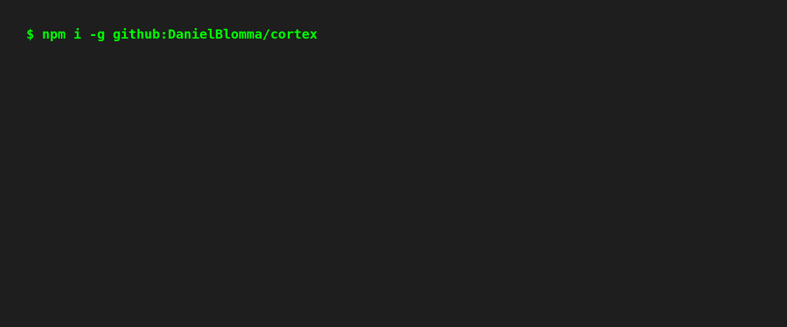

# Cortex

```text
  CCC    OOO   RRRR  TTTTT  EEEEE  X   X
 C   C  O   O  R   R   T    E       X X
 C      O   O  RRRR    T    EEEE     X
 C   C  O   O  R  R    T    E       X X
  CCC    OOO   R   R   T    EEEEE  X   X
```

Local, repo-scoped context platform for coding assistants.



## Quick Start (60s)

```bash
npm i -g github:DanielBlomma/cortex
cd <your-repo>
cortex init --bootstrap
```

Then use:
- `cortex watch status` to confirm automatic background sync.
- `/todo <task>` and `/note <title> [details]` inside Claude Code.
- `cortex plan` to see automatic progress state.

## What Cortex Is (Plain Language)

If you are not an AI engineer, think of Cortex as a **local project memory** for your repository.

Instead of an assistant trying to read everything from scratch on each prompt, Cortex:

1. Scans your code and documentation.
2. Structures it into entities (files, rules, ADRs) and relationships.
3. Builds a local graph + search index.
4. Lets assistants (Codex/Claude) query that context through MCP tools.

Result: better answers, less guessing, and fewer "hallucinated" assumptions.

## Why Use It

- Keeps context **repo-local** by default.
- Reduces giant instruction files (`claude.md`, `agent.md`) by moving knowledge into indexed context.
- Makes assistant output more consistent with your rules/ADRs/source of truth.
- Supports incremental updates so you do not need full re-ingest on every change.

## Quick Start (2 Steps)

### 1. Install Cortex

Requirements:
- Node.js 20+
- npm 10+
- git
- Optional (for auto-connect): `codex` and/or `claude` in `PATH`

Install the CLI globally:

```bash
npm i -g github:DanielBlomma/cortex
```

If global npm requires sudo on macOS:

```bash
sudo npm i -g github:DanielBlomma/cortex
```

### 2. Initialize your repo (automatic setup)

In the repo you want to enable:

```bash
cortex init --bootstrap
```

What `init --bootstrap` now sets up automatically:
- MCP registration for Codex + Claude (if CLIs exist in `PATH`)
- Claude slash commands:
  - `/note`
  - `/todo`
  - `/plan`
  - `/context-update`
- Codex workflow section in `AGENTS.md`
- Background sync watcher (`cortex watch start`) so `cortex update` runs continuously while files change

You can disable auto background sync:

```bash
cortex init --bootstrap --no-watch
```

Daily usage:

```bash
cortex watch status
cortex status
```

Optional git hooks (run `cortex update` after branch switch/merge):

```bash
./scripts/install-git-hooks.sh
```

This installs repo-local `post-checkout` + `post-merge` hooks via `core.hooksPath=.githooks`.
Hook logs are written to `.context/hooks/update.log`.
If parser dependencies are missing, hooks will log a skip until `cortex bootstrap` has been run.

Optional performance boost for large repos:
- Install `fswatch` (macOS) or `inotifywait` (Linux).
- Cortex watch will automatically switch from polling to event-driven mode.

`cortex status` now shows:
- a freshness bar (`update_needed=yes/no`) for repo context
- a Cortex CLI version/update check (when network is available)

Automatic progress is saved in `.context/plan/state.json`.

```bash
cortex plan
cortex todo "Check API pagination edge case"
cortex todo
```

When needed:

```bash
cortex connect
cortex watch stop
cortex watch start
cortex init --force
```

## Verify It Works in Claude/Codex

In your repo directory:

```bash
claude mcp list
```

You should see `cortex` as connected.

For Codex:

```bash
codex mcp list
codex mcp get cortex-<repo-name> --json
```

## Core MCP Tools

- `context.search`: ranked search across File/Rule/ADR
- `context.search` filters:
  - `top_k` (1-20)
  - `include_deprecated` (default `false`)
  - `include_content` (default `false`)
- `context.get_related`: graph neighbors for an entity
- `context.get_rules`: active rules with scope filtering
- `context.reload`: reload graph connection after updates

## Configure What Gets Indexed

Edit `.context/config.yaml`:

- `source_paths`: folders/files Cortex should ingest
- `truth_order`: source priority (ADR/RULE/CODE/WIKI)
- `ranking`: scoring weights (`semantic`, `graph`, `trust`, `recency`)

Then run:

```bash
cortex update
```

## Custom Entity Types (`ontology.cypher`)

To add your own entities (for example `APIContract`, `Test`, `Owner`):

1. Update schema in `.context/ontology.cypher` (`CREATE NODE TABLE`, `CREATE REL TABLE`).
2. Extend `scripts/ingest.mjs` to emit:
   - `.context/cache/entities.<type>.jsonl`
   - `.context/db/import/<Type>.tsv`
3. Extend `mcp/src/loadGraph.ts` to load new TSV data into RyuGraph.
4. Extend `mcp/src/graph.ts` and optionally `mcp/src/search.ts` to expose/query the new types.
5. Rebuild data:

```bash
./scripts/context.sh ingest
./scripts/context.sh graph-load
./scripts/context.sh status
```

## CLI Command Reference

```text
cortex init [path] [--force] [--bootstrap] [--connect] [--no-connect] [--watch] [--no-watch]
cortex connect [path] [--skip-build]
cortex mcp
cortex watch [start|stop|status|run|once] [--interval <sec>] [--debounce <sec>] [--mode <auto|event|poll>]
cortex bootstrap
cortex update
cortex status
cortex ingest [--changed] [--verbose]
cortex embed [--changed]
cortex graph-load [--no-reset]
cortex note <title> [text]
cortex plan
cortex todo [text|list|done <id>|reopen <id>|remove <id>]
cortex help
```

## Project Layout

- `.context/` config, ontology, rules, local cache/db/embeddings
- `scripts/` ingest/update/bootstrap/status orchestration
- `mcp/` TypeScript MCP server
- `docs/` architecture and release notes

## Troubleshooting

- `Unknown command: connect`
  - Your global CLI is old. Run `npm i -g github:DanielBlomma/cortex`.
- `codex` / `claude` not found during init
  - Cortex still works; only auto MCP registration is skipped.
- `mcp/dist/server.js` missing
  - Run `cortex bootstrap`.
- RyuGraph DB warnings on cold start
  - Run `./scripts/context.sh graph-load` or full `./scripts/context.sh bootstrap`.

## Notes on Security Warnings

Current `mcp/` audit is clean with dependency overrides in place.
You may still see upstream deprecation warnings (`ryugraph`, `prebuild-install`) during install.

## Release Status

V2 lock/status: see [`docs/v2-status.md`](docs/v2-status.md).
