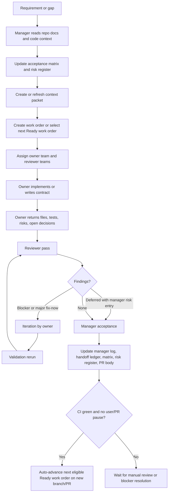

# Agent Workflow Playbook

This playbook defines how a new plan should be created, executed, reviewed, and
auto-advanced. It is written for both the control manager and developers who
need to understand the agent system without reading any chat history.

## Purpose

The agent system exists to keep work controlled when the project has several
parallel concerns. The repo-local documents in this folder are the durable
source of truth so the manager does not rely on a long context window.

## Control Artifacts

| Artifact | Use |
|---|---|
| `agent-work-orders.md` | Work-order backlog, team assignment, dependencies, and status. |
| `context-packets/` | Small packets given to agents so they do not need full chat context. |
| `manager-log.md` | Durable decision log, auto-advance decisions, and validation status. |
| `handoff-ledger.md` | Agent assignments, returned work, review outcomes, and evidence. |
| `acceptance-matrix.md` | Requirement coverage mapped to issue-tracker scope. |
| `risk-register.md` | Open security, privacy, data, delivery, and context risks. |
| `conflict-ledger.md` | Merge conflicts and resolution decisions. |
| `review-iteration-protocol.md` | Required review loop and reviewer role definitions. |

## Team Model

Every work order has one owner team and reviewer teams. The manager should keep
the scope small enough that each team can work from one context packet.

| Team | Responsibility |
|---|---|
| Control Manager | Scope, branch/PR stack, context hygiene, handoffs, gates, merge readiness. |
| Core MCP | MCP server, search/ranking, graph loading, embeddings, daemon, hooks, and tool schemas under `scaffold/mcp/`. |
| CLI and Scaffold | `bin/`, scaffold templates, parser setup scripts, git hooks, install/bootstrap/update flows. |
| Parsers and Ingest | Tree-sitter parsers, chunk extraction, config/resource parsers, benchmark harness ingest behavior. |
| Frontend and Benchmarks | `frontend/`, GitHub Pages, `benchmark/bootstrapbench/`, and `site-data/` static benchmark payloads. |
| Release and Distribution | npm package metadata, plugin manifests, release workflows, version sync, publish readiness. |
| Validation | Root, MCP, frontend, benchmark, audit, and live smoke validation evidence. |
| Security and Privacy | Local-only guarantees, dependency risk, tool misuse paths, permissions, secrets, and network behavior. |

## Workflow

## Context Window Rules

- Every work order starts in a fresh agent session with only its context
  packet plus direct file references. Sessions are never reused across work
  orders.
- Work orders are sized to finish well within one context window. Automatic
  context compaction is treated as a failure signal, not a convenience: nobody
  can verify what a summary dropped.
- If a session approaches compaction, the agent stops, writes durable state to
  the handoff ledger and manager log, and the remainder becomes a new, smaller
  work order with a fresh packet in a fresh session.
- The manager session is bounded by the same rule. At every acceptance the
  control docs must pass the fresh-manager test: a brand-new session must be
  able to continue from the docs alone, with zero chat history. When a manager
  session grows long, complete the current acceptance, write state, and hand
  over to a fresh manager session.
- Heavy investigation runs in subagents whose context is discarded afterwards;
  only their summaries enter the assigning session.
- The manager records decisions in `manager-log.md` before moving to another
  work order.
- The handoff ledger records what changed, which tests ran, residual risks, and
  whether the result was accepted, superseded by review, or blocked.
- Long chat context must never be the only place where a decision or blocker is
  stored.
- When a work order is auto-advanced, the manager opens or updates a new branch
  so the user's manual review of the previous PR stays isolated.

## Required Gates

| Gate | Minimum evidence |
|---|---|
| Contract | Entities, ownership, policy, schema, and source decisions documented. |
| Implementation | Focused tests for changed behavior and negative cases. |
| Code Quality | Code follows local patterns, has meaningful names, useful comments only, and no avoidable duplication. |
| Security | Authz, masking, token/session behavior, tool misuse, and denied access verified. |
| Audit | Protected actions emit audit events or explicitly documented residual risk. |
| Validation | Focused tests during iteration; the full project matrix once at acceptance, with CI as the authoritative full run. |
| Staging | Current deploy authority identified and smoke evidence recorded. |
| Merge | Conflict ledger checked, PR stack order known, accepted review findings closed, PR mapped to its work order in `acceptance-matrix.md`. |

## Auto-Advance Rule (Canonical)

This is the canonical statement of the auto-advance rule; the README, work
orders, and review protocol link here instead of restating it.

After a work order reaches manager acceptance and CI is green, the manager
moves on automatically unless the user, PR feedback, or a blocking risk says to
pause. Auto-advance must be logged in `manager-log.md`, and downstream work
must carry forward any explicit deferrals.

- Multiple `Ready` work orders may run in parallel when their owned
  file/entity scopes are disjoint. The manager records the disjoint-scope
  check in `manager-log.md` before starting parallel work.
- Each new work order branches off the default branch once its dependencies
  are merged. Stack on an unmerged branch only when a dependency is still
  unmerged, and record the stack position in the PR body. Deep stacks delay
  the default branch by one manual merge per level, so prefer flattening:
  merge accepted PRs to the default branch rather than into their parent
  branch when the stack allows it.
- Parallel agents never share a working directory: one `git worktree` (or
  clone) per agent. A shared checkout lets one agent's commit or branch switch
  sweep up another agent's uncommitted work.

## PR Classification For Human Reviewers

Every PR gets exactly one `class:*` label, ideally applied automatically by a
workflow from the changed paths. The label tells a human reviewer which review
depth the PR needs before approving:

| Label | Meaning | What the human reviewer does |
|---|---|---|
| `class:docs-only` | Only docs/markdown; no runtime code | Quick read. Note: control docs steer agents, so policy changes still deserve attention. |
| `class:tests-only` | Only test files; no runtime behavior change | Check the tests assert meaningful behavior; quick approve otherwise. |
| `class:deployable` | Changes the running app; merge produces a new artifact | Full review; focus where the PR body points. |
| `class:infra-sensitive` | Workflows, scripts, or infrastructure code | Highest bar: deploy/security surface. Verify gate ordering, permissions, and secrets handling. |

The class maps to the work profiles in `review-iteration-protocol.md`; if the
label and the declared profile disagree, ask the manager before approving.

## Creating A New Plan

1. Search the repo docs and code context for the requirement, existing rules,
   and related code paths.
2. Update or create a context packet with scope, source evidence, changed
   surfaces, required reviewers, validation gates, and open decisions.
3. Add or update rows in `agent-work-orders.md` with dependencies and status.
4. Add acceptance criteria to `acceptance-matrix.md`.
5. Add risks to `risk-register.md` before implementation starts.
6. Assign reviewers before first-pass work starts.
7. Keep each branch focused on one work order unless the manager documents why
   a combined branch is lower risk.
